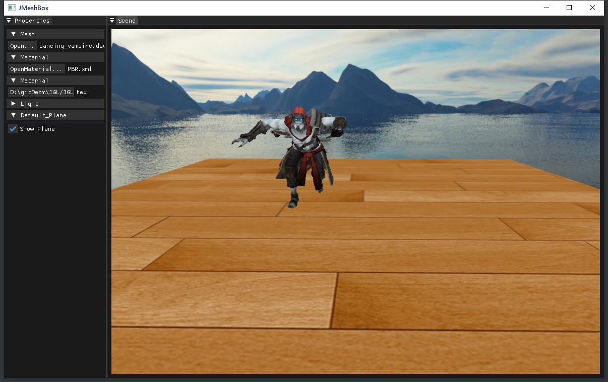

# JGL Demos

日常学习shader使用项目

-1.[Editor](sections/JGLEditor.md)
-2.[模拟2d天气效果](sections/weather.md)
1. 模拟2d天气效果

2. 星空效果

3. LUT shader

[(2条消息) [OpenGL\] 动态的水面模拟_opengl 水波_ZJU_fish1996的博客-CSDN博客](https://blog.csdn.net/zju_fish1996/article/details/52317363)

Glew:
http://glew.sourceforge.net/

GLFW:
https://www.glfw.org/

GLM:
https://glm.g-truc.net/0.9.9/index.html

Assimp:
https://github.com/assimp/assimp

ImGUI:
https://github.com/ocornut/imgui
